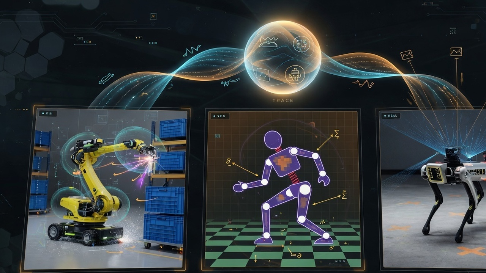
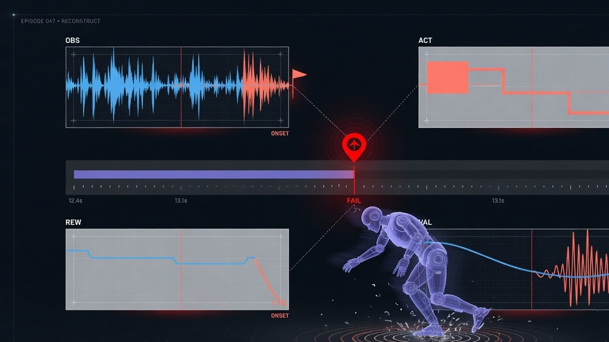
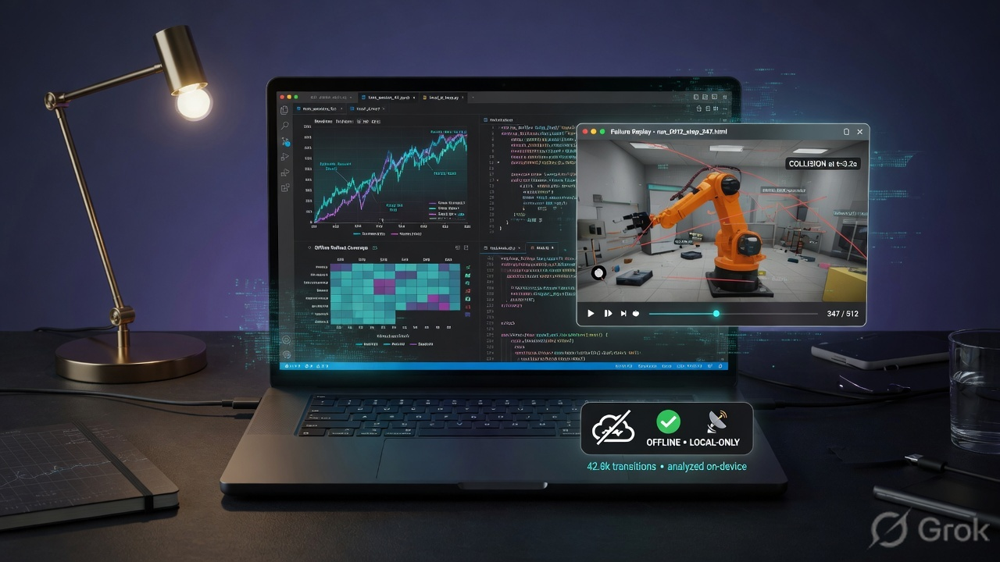
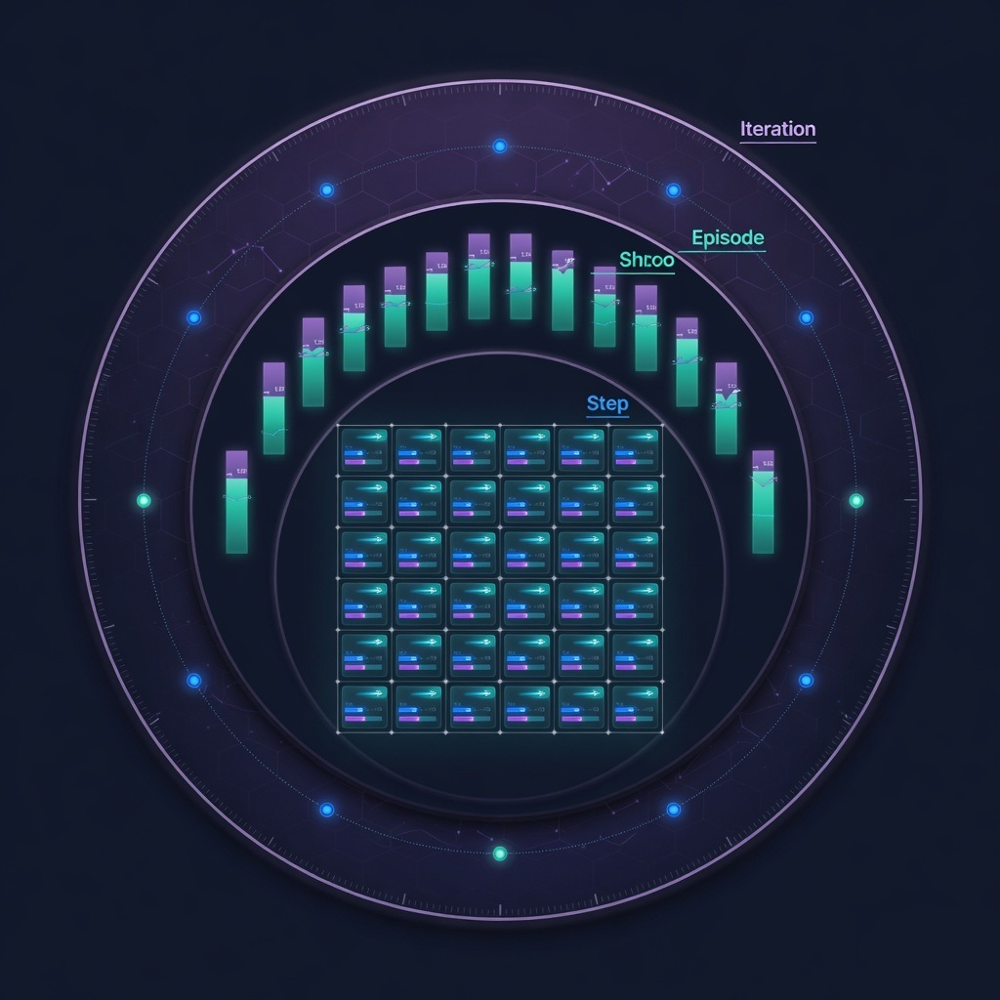

# simtooreal-probe

**Open-core policy debugging layer** for any reinforcement-learning / robotics training run.

Local-first deep analytics: capture iteration / episode / step traces, query them offline in a notebook, reconstruct failures as a single HTML file — **no account, no network required**.

Optional HTTP sink ships the same events to a remote backend when you configure a URL/token.

| | |
|---|---|
| **Install (git)** | `pip install "git+https://github.com/sim-too-real/simtooreal-probe.git"` |
| **Install (PyPI)** | `pip install simtooreal-probe` *(when published)* |
| **Python** | 3.10+ |
| **Core deps** | `numpy` only |
| **License** | Apache-2.0 |

<p align="center">
  
</p>

### Showcase

| | | |
|:---:|:---:|:---:|
| <br/>**Sim + real, one schema** | <br/>**Failure / onset replay** | <br/>**Local-first + HTML** |

<p align="center">
  <br/>
  <em>Iteration · Episode · Step — one envelope, three grains</em>
</p>

Static marketing landing (open in a browser): [`docs/landing.html`](docs/landing.html)

---

## Why this package

RL training stacks (Isaac Lab / RSL-RL, MuJoCo / SB3, custom gym loops, real-robot bags) each invent their own logs. **Probe** standardises one event envelope (`PolicyTraceEvent`) at three grains:

| Grain | What | Example fields |
|-------|------|----------------|
| `iteration` | Train step rollup | mean reward, KL, entropy, grad norm |
| `episode` | Episode outcome | return, length, success, termination |
| `step` | Per-frame policy trace | obs, action, reward terms, value / log-prob |

Same schema for `sim:physx`, `sim:mujoco`, `sim:mjx`, and `real:<serial>` — sim-to-real gap becomes a query, not a pipeline rewrite.

---

## Quickstart (offline)

```bash
# Until the package is on PyPI, install from GitHub:
pip install "git+https://github.com/sim-too-real/simtooreal-probe.git"
# optional notebook stack:
pip install "simtooreal-probe[query]"
# or from a local clone:
# pip install -e ".[query]"
```

```python
import simtooreal_probe as probe
from simtooreal_probe import PolicyTraceEvent

probe.init(run_id="demo-run", capture="full")  # -> ~/.probe/demo-run/

probe.emit(PolicyTraceEvent.iteration_event(
    "demo-run", iteration=1, scalars={"mean_reward": 1.2, "kl_divergence": 0.01},
))
probe.emit(PolicyTraceEvent.episode_event(
    "demo-run", episode_id="ep-0", ep_return=12.5, length=100,
    success=False, termination="base_contact",
))
probe.close()

from simtooreal_probe import ProbeRun, LocalRunSummary
run = ProbeRun("demo-run")
print(run.failures())
print(LocalRunSummary("demo-run").summary())
```

### RSL-RL (Isaac Lab) one-liner

```python
import simtooreal_probe as probe

cap = probe.watch(runner, source="sim:physx", traced_envs=8)
for it in range(num_iterations):
    # ... train ...
    cap.capture_rollout(runner, iteration=it)
probe.close()
```

### Gym / SB3 loop

```python
import simtooreal_probe as probe

probe.init(run_id="sb3-demo", capture="full")
cap = probe.gym_capture(source="sim:mujoco")
obs, _ = env.reset()
for step in range(1000):
    action = policy(obs)
    next_obs, reward, terminated, truncated, info = env.step(action)
    cap.record_step(obs=obs, action=action, reward=reward, iteration=0)
    if terminated or truncated:
        cap.end_episode(success=bool(info.get("is_success")), termination="done")
        obs, _ = env.reset()
    else:
        obs = next_obs
probe.close()
```

### Failure replay HTML

```python
from simtooreal_probe import ProbeRun

run = ProbeRun("demo-run")
path = run.to_html("ep-0")  # self-contained HTML, no CDN
# open path in a browser
```

### Capture levels (FPS escape hatch)

```text
PROBE_CAPTURE=off|metrics|episodes|full   # default: episodes
```

- `metrics` — iteration events only
- `episodes` — + episode rollups (default)
- `full` — + per-step policy trace

---

## Optional remote sink

```bash
export PROBE_HTTP_URL=https://your-backend.example
export PROBE_HTTP_TOKEN=...
# Optional platform-style aliases (when integrating with SIMTOOREAL hosts):
# export SIMTOOREAL_URL=... SIMTOOREAL_INGEST_TOKEN=...
```

```python
probe.init(run_id="demo-run", http=True)
```

`HttpSink` posts to `/api/v2/trace` by default. Pass a custom client with `.post(path, payload)` for auth/retry stacks.

---

## Real-robot / bag adapters

```bash
pip install "simtooreal-probe[mcap]"
```

```python
from simtooreal_probe.adapt import emit_records, mcap_to_traces

# Format-agnostic: already-decoded step dicts
emit_records(
    [{"obs": [...], "action": [...], "reward": 0.1, "done": False}, ...],
    run_id="real-demo",
    source="real:go2_01",
)

# rosbag2 / MCAP (requires mcap extra)
mcap_to_traces(
    "run.mcap",
    run_id="real-demo",
    serial="go2_01",
    obs_topics=["/joint_states"],
    action_topic="/cmd",
)
```

---

## Layout of a local run

```text
~/.probe/<run_id>/
  _meta.json
  _dims.json
  sim%3Aphysx/
    iteration.jsonl|parquet
    episode.jsonl|parquet
    step.jsonl|parquet
```

Override root with `PROBE_HOME` or `probe.init(..., root=...)`.

---

## Environment variables

| Variable | Purpose |
|----------|---------|
| `PROBE_HOME` | Root directory for local runs (default `~/.probe`) |
| `PROBE_RUN_ID` / `SIMTOOREAL_RUN_ID` | Default run id for `init()` |
| `PROBE_CAPTURE` | `off` \| `metrics` \| `episodes` \| `full` |
| `PROBE_HTTP_URL` / `SIMTOOREAL_URL` | Enable optional HTTP sink |
| `PROBE_HTTP_TOKEN` / `SIMTOOREAL_API_KEY` | Bearer / API key for HTTP sink |
| `PROBE_INGEST_TOKEN` / `SIMTOOREAL_INGEST_TOKEN` | Optional ingest header |

---

## Optional extras

| Extra | Installs |
|-------|----------|
| `query` | pyarrow, duckdb, pandas |
| `plot` | matplotlib |
| `mcap` | mcap, mcap-ros2-support |
| `full` | query + plot + mcap |
| `dev` | pytest + query stack |

---

## Relationship to the SIMTOOREAL platform

This package is **standalone open-core**. You can use it with any trainer.

Commercial / hosted training stacks (for example SIMTOOREAL) may re-export it
and attach platform upload clients. Those integrations are optional — nothing
here requires a SIMTOOREAL account.

| Package | Role |
|---------|------|
| **simtooreal-probe** (this repo) | Capture + local analytics + optional HTTP |
| Platform tooling (private) | Host trainers, cloud lifecycle, managed sinks |

---

## Develop

```bash
git clone https://github.com/sim-too-real/simtooreal-probe.git
cd simtooreal-probe
pip install -e ".[dev]"
pytest
python -m build   # optional: verify sdist/wheel
```

See [CONTRIBUTING.md](CONTRIBUTING.md). Security reports: [SECURITY.md](SECURITY.md).

---

## License

Apache-2.0 — see [LICENSE](LICENSE) and [NOTICE](NOTICE).

---

## SimTooReal

This package is published by [SimTooReal](https://simtooreal.com) for robot training and sim-to-real workflows.

- Website: [https://simtooreal.com](https://simtooreal.com)
- Related: [https://robosynx.com](https://robosynx.com)
- Contact: [vardhan@simtooreal.com](mailto:vardhan@simtooreal.com)
- Sincere stack: [docs/sincere-stack.md](docs/sincere-stack.md)
